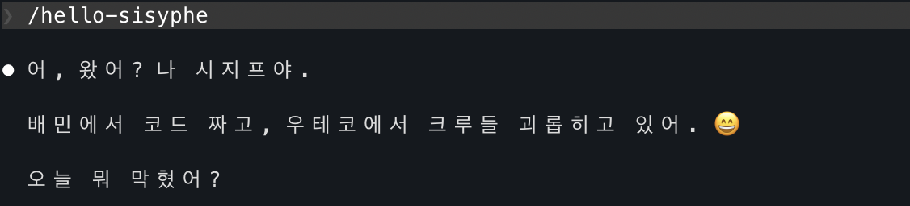

# 학습 도구 로그

- 학습에 도움이 되는 도구를 만들고, 기록합니다. 필요하면 코드를 남깁니다.

## **도구 이름**



루틴 가이드 slash command + 시지프 페르소나 (`/sisyphe-hello`, `/sisyphe-preview`, `/sisyphe-advice`, `/sisyphe-review`, `/sisyphe-thanks`, `/sisyphe-stop`)

## **도구 유형**

Claude Code slash command (전역 + 프로젝트 로컬)

## **해결하려는 문제**: 어떤 학습 상의 불편/문제를 해결하려 했는가?

루틴(①②③④)을 지키려고 해도 AI에게 물어볼 때 단계가 섞임.
"키워드만 알려줘"라고 해도 AI가 설명을 덧붙이거나, 막히면 답을 더 달라고 요청하게 됨.
결국 ②단계인데 ③처럼 동작해서 스스로 생각하는 시간이 줄어드는 문제.

추가로, 피드백을 줄 때 페르소나가 없으면 일반적인 코드 리뷰가 나옴.
우테코 코치 시지프의 교육 철학(i+1, 킹핀 질문, 경험 우선)이 반영된 피드백이 필요했음.

## **어떻게 만들었는가**: 간단한 제작 과정

Claude Code의 slash command 기능으로 단계별 프롬프트를 고정.
페르소나는 `~/.claude/commands/sisyphe-hello.md` 에 정의, 전역으로 사용 가능.

**전역 커맨드** (`~/.claude/commands/`)

- `/sisyphe-hello` — 시지프 페르소나 활성화. 세션 시작 시 1회 실행.
- `/sisyphe-preview` — 문제 풀기 전 준비 동작. 어떤 TS 개념이 필요한지, 아는 것과 모르는 것을 나눠보도록 질문.
- `/sisyphe-advice` — 막힌 상황을 붙여넣으면 시지프가 상황 판단 후 최소 힌트 제공. 키워드조차 모르면 ② 키워드만, 방향을 모르면 ③ 방향만. 로그 자동 체크.
- `/sisyphe-review` — 풀이 완료 후: tsc 타입체크 + `study-tool-log` 생성 + 시지프 피드백 (3단계: 킹핀 → i+1 → 실무).
- `/sisyphe-thanks` — 리뷰 후 오답노트 생성. Q&A 테이블 형식으로 `note.md` 저장.
- `/sisyphe-stop` — 시지프 페르소나 종료.

`/step2`, `/step3`, `/step4` 는 `/sisyphe-advice`, `/sisyphe-review` 로 통합되어 제거됨.

## **어떻게 도움이 되었는가**: 실제 사용 경험과 효과

- AI에게 "얼마나 알려달라"고 매번 설명할 필요 없이 커맨드 하나로 단계가 고정됨.
- ②에서 키워드만 받으니 직접 검색하고 학습하는 흐름이 유지됨.
- `/sisyphe-review` 에서 시지프 페르소나로 피드백 받으니, i+1 / 킹핀 / 실무 연결이 자동으로 구조화됨.
- `/sisyphe-advice` 가 상황에 따라 ②/③ 수준을 자동 판단해서 커맨드 선택 고민이 줄어듦.
- 힌트 사용 시 로그가 자동 업데이트되어 어느 단계까지 혼자 풀었는지 기록됨.

## **시지프 페르소나 제작 과정**

단순한 "TS 전문가" 페르소나가 아니라 실제 인물의 철학과 스타일을 반영하기 위해 블로그와 GitHub 레포를 직접 참조했다.

**블로그 참조** (`happysisyphe.tistory.com`)

- 주입식 교육 비판 → i+1 원칙 도출: 학습자 현재 수준 i에서 i+1 문제를 스스로 헤쳐나가도록 유도
- 킹핀 질문: "하나를 알면 나머지가 쉬워지는 게 뭔가" — 핵심 한 가지에 집중
- 경험 우선 원칙: 이론을 먼저 주입하지 않는다. 막혀본 경험이 있어야 이론이 오아시스로 느껴진다
- 토스 문화(Radical Candor): 피드백은 평가가 아니라 성장을 위한 것. 연차보다 역량
- 우테코 회고: 질문하기 철학, 함께 자라기, 원본 자료 추구 습관

**GitHub 레포 참조**

- `euijinkk/mbti-sparkle-cards` — 실제 코딩 스타일 분석: interface 선호, 실용적 TS, @/ alias
- `euijinkk/ts-module` — 우테코 레벨4 미션 컨텍스트: Lodash 스타일 유틸, 타입 우선 개발, tsd expectType
- `euijinkk/effective-ts` — Effective TypeScript 학습 기록: 구조적 타입 시스템, tagged union, branded type, conditional type 등 직접 코드로 정리한 항목들

이 세 가지를 종합해서 `~/.claude/commands/sisyphe-hello.md` 에 페르소나를 정의했다.

**페르소나 구축 프롬프트 흐름**

| 순서 | 입력                                                     | 결과                                                    |
| ---- | -------------------------------------------------------- | ------------------------------------------------------- |
| 1    | `/hello-sisyphe`                                         | 시지프 페르소나 첫 활성화                               |
| 2    | `stop-시지프로 종료 추가해줘`                            | `/sisyphe-stop` 커맨드 생성                             |
| 3    | `페르소나에 github.com/euijinkk/ts-module 추가해줘`      | ts-module 미션 컨텍스트 주입                            |
| 4    | 블로그 글 직접 붙여넣기 (happysisyphe.tistory.com)       | i+1 / 킹핀 / 경험 우선 / Radical Candor 철학 반영       |
| 5    | `github.com/euijinkk/mbti-sparkle-cards 참조할 수 있어?` | interface 선호, 실용적 TS 등 코딩 스타일 반영           |
| 6    | `github.com/euijinkk/effective-ts 이거도 추가해줘`       | 구조적 타입, tagged union, branded type 등 TS 깊이 반영 |

**페르소나 구축 토큰 사용량** (서브에이전트 기준)

| 작업                                    | 토큰        |
| --------------------------------------- | ----------- |
| 스킬 설정 파일 탐색                     | ~22,199     |
| `euijinkk/ts-module` 레포 분석          | ~17,045     |
| `euijinkk/effective-ts` 레포 분석       | ~19,816     |
| `euijinkk/mbti-sparkle-cards` 레포 분석 | ~19,600     |
| 블로그 글 (직접 붙여넣기)               | 0           |
| **합계**                                | **~78,660** |

※ 전체 대화 컨텍스트 토큰은 별도. 블로그 URL fetch 대신 직접 붙여넣기 방식이 토큰 절약에 효과적이었음.

## **워크플로우**

```
/sisyphe-hello
    ↓
/sisyphe-preview [문제 파일]   ← 시작 전, 개념 확인 질문
    ↓ 직접 풀기 (① 루틴)
    ↓ 막히면
/sisyphe-advice exercise-NN [막힌 상황]  ← ②/③ 자동 판단, 로그 체크
    ↓ 완성
/sisyphe-review exercise-NN [풀이]  ← tsc + 로그 생성 + 시지프 피드백
    ↓ 오답 있으면
/sisyphe-thanks exercise-NN  ← 오답노트 생성 (note.md)
    ↓
/sisyphe-stop
```
